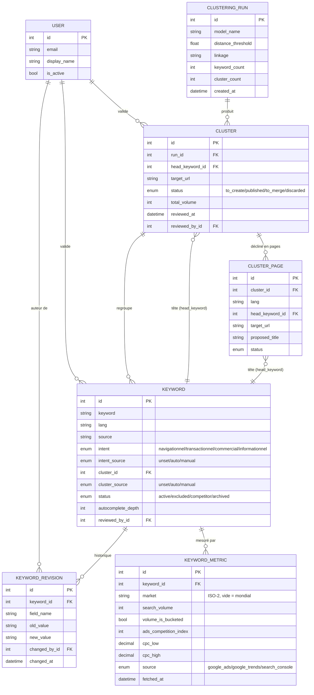

## Modèle de données

Le schéma a évolué en 4 migrations Alembic successives : schéma initial
(`Keyword` / `SeasonalityRecord`), ajout du clustering sémantique
(`Cluster`, `ClusteringRun`), séparation cluster/page par langue
(`ClusterPage`), puis ajout du suivi de validation humaine
(`reviewed_at`, `reviewed_by_id`, `KeywordRevision`).

Principe central : **une décision humaine n'est jamais écrasée par le
pipeline automatique**. Chaque champ sujet à un recalcul (`intent`,
`cluster`) a un `*_source` (`unset` / `auto` / `manual`) — les
traitements par lot filtrent sur `auto` et laissent `manual` intact.
Chaque modification est tracée dans `KeywordRevision`, avec l'ancienne
et la nouvelle valeur.



`SeasonalityRecord` (saisonnalité Google Trends) reste volontairement en
dehors de ce schéma relationnel : données re-téléchargeables à tout
moment, sans décision humaine à protéger.

## Migrations

Le schéma est versionné avec **Alembic** :

```bash
# Appliquer toutes les migrations
uv run alembic upgrade head

# Générer une nouvelle migration après modification de models.py
uv run alembic revision --autogenerate -m "description du changement"

# Revenir en arrière d'une révision
uv run alembic downgrade -1
```
