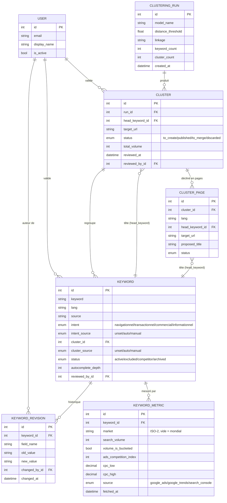

# seo-keywords-madagascar

Collecte et analyse de mots-clés touristiques pour Madagascar (excursions, circuits, tours, agences de voyage) avec analyse de saisonnalité (haute saison avril-décembre vs saison cyclonique janvier-mars).

## Approche

Pas de scraping de pages de résultats Google (fragile, contre les CGU). Trois sources publiques et légales :

1. **Google Autocomplete** — endpoint JSON public utilisé par la barre de recherche Google elle-même. Sert à étendre une liste de mots-clés "seed" en dizaines de variantes réellement tapées par les internautes.
2. **Google Trends** (via `pytrends`) — volume d'intérêt relatif (0-100) dans le temps, permettant de dégager le pattern saisonnier par mot-clé et par marché (FR, DE, US, IT...).
3. **Google Ads API** (Keyword Planner) — volume de recherche estimé, niveau de concurrence publicitaire et fourchette de CPC, via un compte approuvé au niveau d'accès Explorer.

## Installation

```bash
uv sync
```

## Utilisation

```bash
# 1. Étendre les seeds via Autocomplete et sauvegarder en base (data/processed/keywords.db)
uv run seo-keywords expand --lang fr
uv run seo-keywords expand --lang en
uv run seo-keywords expand --lang de

# 2. Interroger Google Trends pour la saisonnalité (marché mondial par défaut)
uv run seo-keywords seasonality --lang en --top 15 --geo ""

# Comparer un marché spécifique (ex: France)
uv run seo-keywords seasonality --lang fr --top 15 --geo FR

# 3. Exporter les CSV finaux
uv run seo-keywords export --geo ""
```

Les exports finaux atterrissent dans `data/processed/` :

- `seasonality_monthly_<marché>.csv` — score par mois (Jan-Déc)
- `seasonality_summary_<marché>.csv` — moyenne haute saison vs saison cyclonique

## Tests

Tous les appels réseau externes sont mockés dans les tests (`responses` pour les requêtes HTTP, `unittest.mock` pour `pytrends`) — la suite tourne sans connexion internet et sans dépendre de la disponibilité de Google.

```bash
uv run pytest
```

## Architecture

```
src/seo_keywords/
├── config.py           # seeds, langues, définition des saisons
├── collectors/
│   ├── base.py          # interface commune (KeywordSuggestion, BaseCollector)
│   ├── autocomplete.py  # Google Suggest
│   └── trends.py        # Google Trends
├── storage/
│   ├── models.py        # modèles SQLModel (Keyword, Cluster, ClusteringRun, ...)
│   └── repository.py    # accès SQLite, dédoublonnage
├── analysis/
│   ├── intent_classifier.py    # classification d'intention de recherche
│   ├── language_detector.py    # détection de langue
│   ├── clustering.py           # clustering par seed
│   ├── semantic_clustering.py  # clustering sémantique
│   ├── cluster_pages.py        # génération d'une page par cluster/langue
│   ├── cluster_qa.py           # contrôle qualité des clusters
│   ├── curation.py             # validation humaine
│   └── seasonality.py          # agrégation par saison, exports CSV
└── cli.py               # `seo-keywords <commande>`
```

## Modèle de données

Le schéma a évolué en 4 migrations Alembic successives : schéma initial (`Keyword` / `SeasonalityRecord`), ajout du clustering sémantique (`Cluster`, `ClusteringRun`), séparation cluster/page par langue (`ClusterPage`), puis ajout du suivi de validation humaine (`reviewed_at`, `reviewed_by_id`, `KeywordRevision`).

Principe central : **une décision humaine n'est jamais écrasée par le pipeline automatique**. Chaque champ sujet à un recalcul (`intent`, `cluster`) a un `*_source` (`unset` / `auto` / `manual`) — les traitements par lot filtrent sur `auto` et laissent `manual` intact. Chaque modification est tracée dans `KeywordRevision`, avec l'ancienne et la nouvelle valeur, pour pouvoir répondre à « pourquoi ce mot-clé est-il classé ainsi ? » plusieurs mois après coup.



`SeasonalityRecord` (saisonnalité Google Trends) reste volontairement en dehors de ce schéma relationnel : ce sont des données re-téléchargeables à tout moment, sans décision humaine à protéger, donc pas de lien de clé étrangère avec `Keyword`.

## Migrations

Le schéma est versionné avec **Alembic** :

```bash
# Appliquer toutes les migrations
uv run alembic upgrade head

# Générer une nouvelle migration après modification de models.py
uv run alembic revision --autogenerate -m "description du changement"

# Revenir en arrière d'une révision
uv run alembic downgrade -1
```

Historique des migrations : schéma initial → clustering sémantique (`Cluster`, `ClusteringRun`) → pages par cluster/langue (`ClusterPage`) → suivi de validation humaine (`reviewed_at`, `KeywordRevision`).

## Limites connues

- Google Trends donne un volume relatif, pas absolu. L'API Google Ads (Keyword Planner) comble en partie ce manque, mais ne chiffre que les volumes au-dessus d'un seuil publicitaire — la longue traîne reste sans chiffre exact (`autocomplete_depth` sert alors de signal de popularité de repli).
- Les volumes Google Ads renvoyés sur un compte sans dépense publicitaire sont des représentants de tranche (10, 50, 500, 5000, 50000), pas une mesure exacte — d'où le champ `volume_is_bucketed` dans `KeywordMetric`.
- Une fois `sakalavatours.com` indexé, connecter Google Search Console donnera les requêtes exactes des visiteurs réels — la donnée la plus fiable, en complément.
- Respecter un délai entre requêtes (`SEO_REQUEST_DELAY_SECONDS` dans `.env`) pour rester correct vis-à-vis des endpoints publics utilisés.

## Roadmap possible

- Ajout d'un collecteur Bing Suggest (même interface `BaseCollector`)
- Intégration Google Search Console API une fois le site indexé
- Dashboard de visualisation (Streamlit ou export vers Grafana)
- Cron sur l'infra `medevstack` existante (Docker + GitHub Actions)
